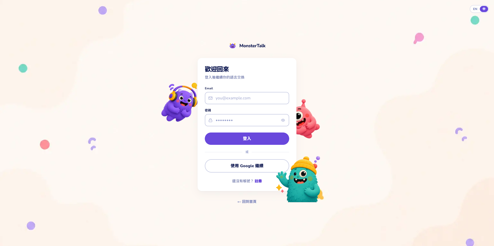
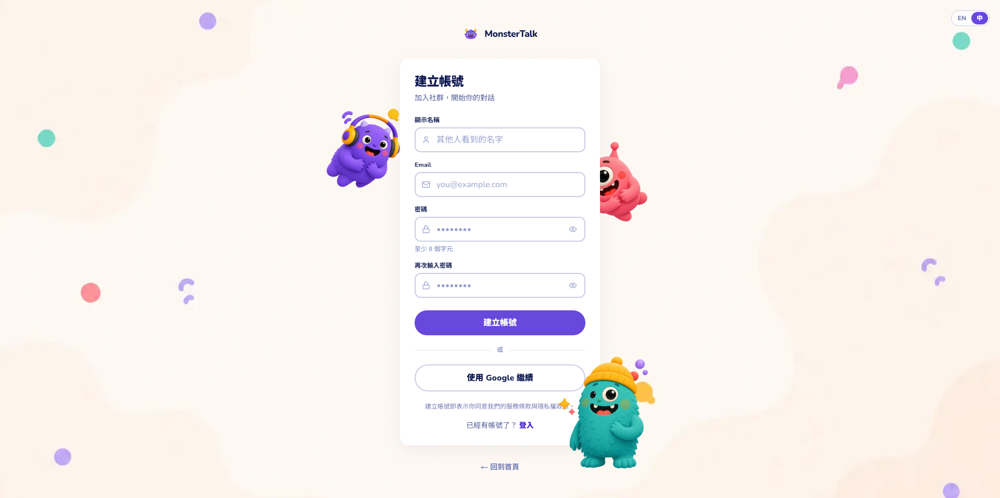
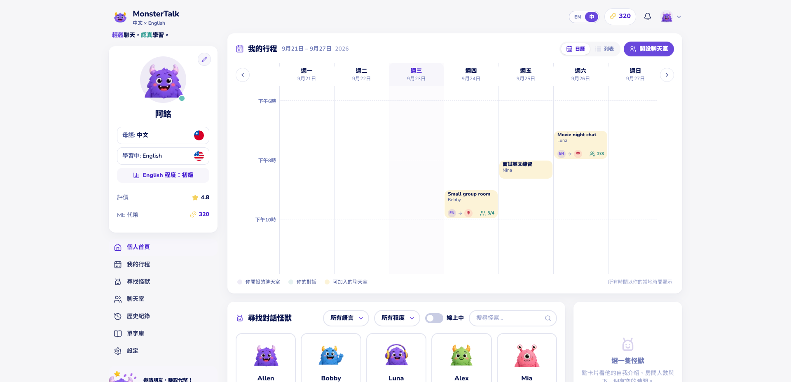
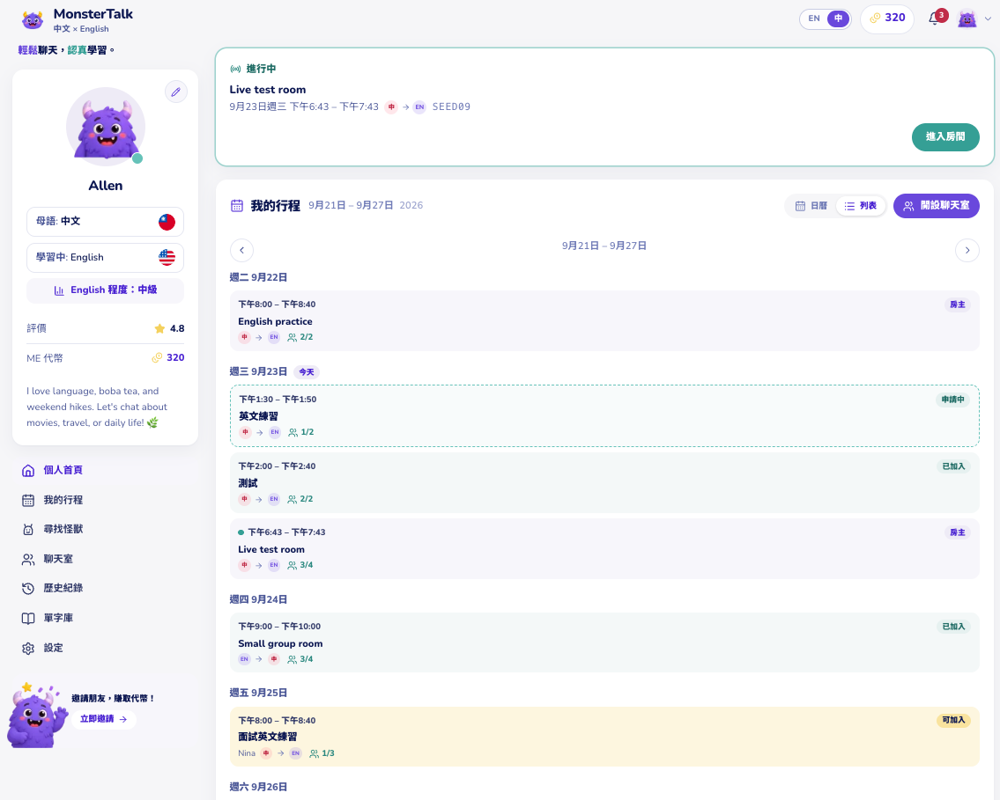
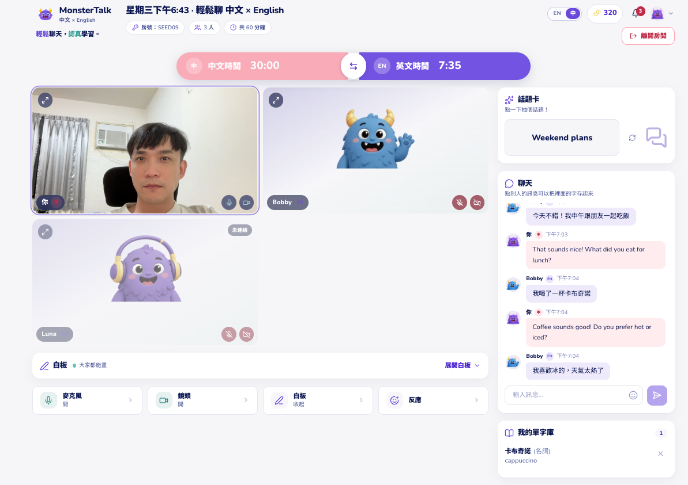
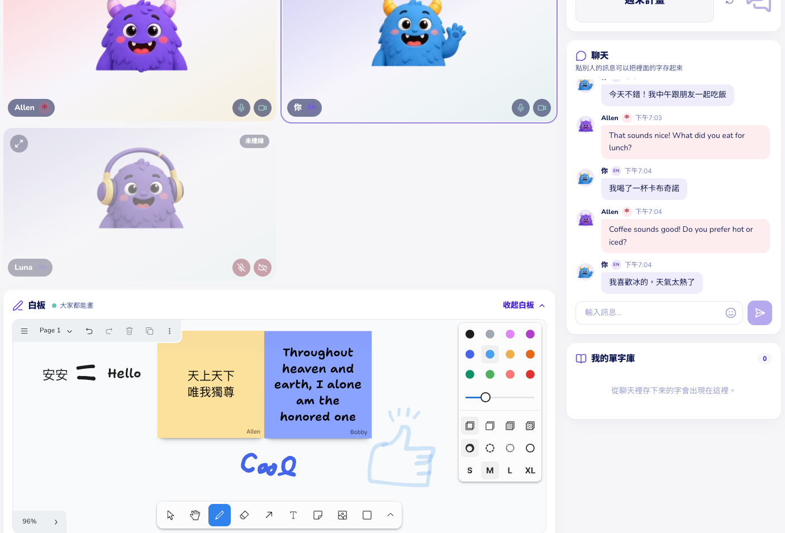
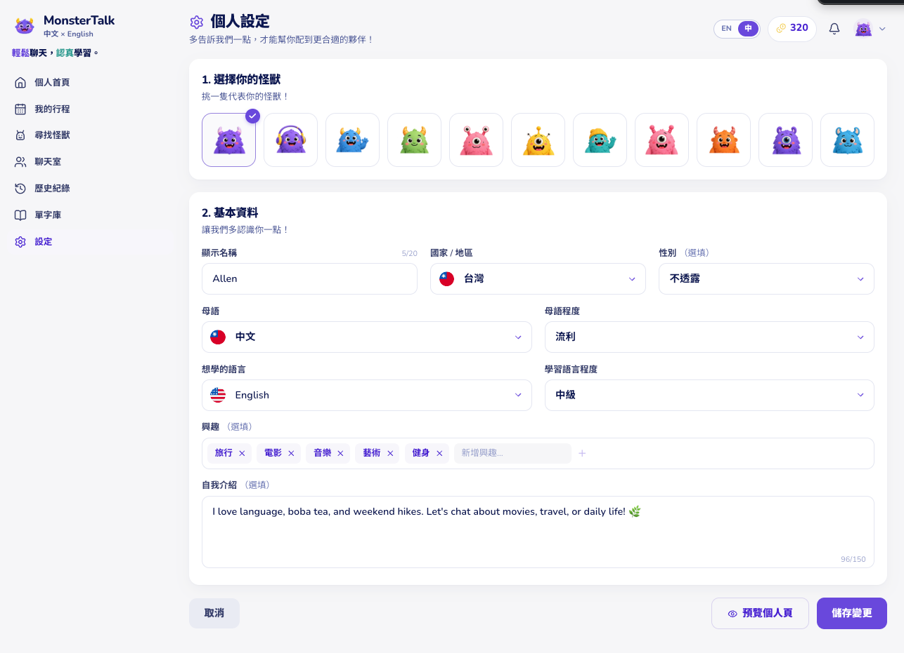

# EnglishTalk — 雙語學習空間

## 開場（30 秒）

各位有沒有過這種經驗：想跟朋友練習英文，但時差太遠，或是沒有好工具協作？

今天我想分享一個我們做的東西：**一個兩個人可以同時用視訊、聊天、白板一起學英文的空間。**

---

## 一開始很簡單

進去時需要登入或註冊，流程很快。

---

## 痛點 + 解決（1 分鐘）

**傳統的語言交換很碎片**：一邊打字一邊講話，遇到不會的詞沒地方記，聊到好玩的話題也沒人幫你整理。

**我們做的就是把這些都放在一起**——講話的時候邊上白板畫，講到的詞直接按一下就存起來，下次複習的時候一打開就看得到。

---

## 你的學習日程

登入後，首頁顯示**接下來的房間**。用週曆或總覽檢視，隨時看得到跟誰、什麼時候要一起練習。

---

## 進房：一個空間，三個功能（2.5 分鐘故事）

想像你在房間裡遇到一個英文母語者。

**你們進房**：打開視訊能看到彼此、聽彼此的聲音。

**對方用英文說了一個生活片段**，你聽不懂的詞就直接點上白板、一起畫一下，或是打出來讓你記住。

**整個對話的詞彙、進度，房間關掉時都自動存下來**。下次你想複習，就能看到上次學的是什麼、怎麼用的。

**白板是你們共同的草稿紙**——一邊聊天、一邊畫、一邊記。兩邊的筆跡實時同步，就像坐在同一張桌子前。

---

## 你的學習紀錄

房間裡存下來的詞、對話內容，都在**個人資料**裡保存著。隨時可以回來複習或分享給朋友。

---

## 邀請（1 分鐘）

我們現在已經上線了。誰想試試看，待會我可以邀你們進一個房間，真的體驗一下兩人對話是什麼感覺。

或者有興趣一起加入開發、優化這個想法的，也很歡迎。

---

**發表版本**  
2026-09-23 · EnglishTalk_CoCreate
